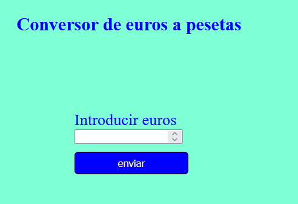

# Relación de ejercícios php certificado profesional

**Índice**   
1. [Ejercicio1](#id1)
2. [Ejercicio2](#id2)
## ejercicio 1 
Realiza un conversor de euros a pesetas. Ahora la cantidad en euros que se quiere convertir se deberá introducir por teclado.

## ejercicio 2 
 Escribe un programa que calcule el total de una factura a partir de la base imponible. Se
considera un IVA del 21%

